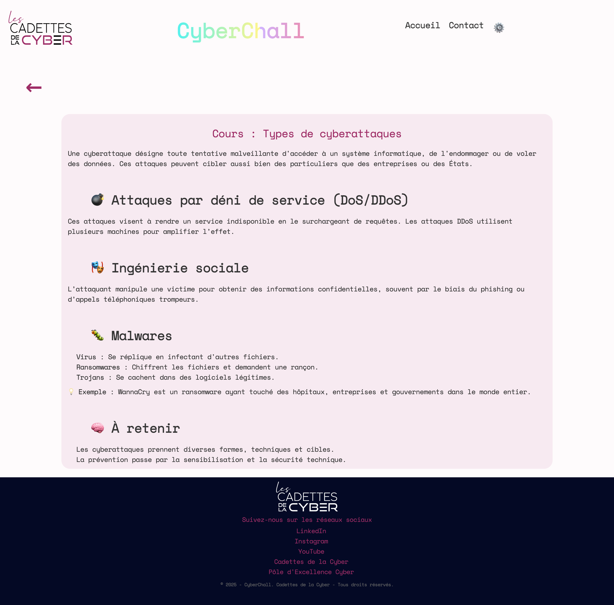

# CyberChall – Application Web de Sensibilisation à la Cybersécurité

## Présentation

**CyberChall** est une application web éducative destinée à accompagner les **Cadettes de la Cyber** dans leurs ateliers de sensibilisation auprès des élèves.  
Elle propose des **modules interactifs** autour de thématiques cybersécurité (cours, quiz, challenges), accessibles via des **sessions temporaires sécurisées**.  
Développée avec **Spring Boot**, **Thymeleaf** et **MySQL**, elle respecte la nouvelle **charte graphique** du site officiel des Cadettes de la Cyber.

## Technologies

- **Back-end** : Spring Boot (Java 17)
- **Front-end** : Thymeleaf, HTML, CSS, JS
- **Base de données** : MySQL
- **Sécurité** : Spring Security, hashage SHA+Base64, regex, JSoup
- **QR Codes** : génération sécurisée via token encodé
- **Build** : Maven

## Installation

### Prérequis
- Java 17+
- Maven
- MySQL (ou autre SGBD compatible)

### Clonage et exécution

```bash
git clone https://github.com/CadettesDeLaCyber/CyberChall.git
cd CyberChall
mvn clean install
mvn spring-boot:run
```

Accessible sur : http://localhost:4040

## Structure du Projet

```
src/
├── main/java/com/cadettesdelacyber/CyberChall
│   ├── config/            # Sécurité, encodage, MVC
│   ├── controllers/       # Gestion des requêtes HTTP
│   ├── services/          # Logique métier
│   ├── repositories/      # Interfaces JPA (Accès à la base de données)
│   ├── models/            # Entités (JPA)
│   └── CyberChall.java    # Point d'entrée Spring Boot
└── main/resources/templates/  # HTML (Thymeleaf)
    ├── admin 
    ├────────── account.html
    ├────────── accueil-admin.html
    ├────────── connexion-admin.html
    ├────────── create-account.html
    ├── fragments
    ├────────── footer.html
    ├────────── header.html
    ├────────── nav.html
    ├────────── nav-minimal.html
    ├── modules
    ├────────── accueil-modules.html
    ├────────── challenge.html
    ├────────── cours.html
    ├────────── create-module.html
    ├────────── list-modules.html
    ├────────── quiz.html
    ├── session
    ├────────── create-session.html
    ├────────── list-session.html
    ├────────── accueil-temporaire
    ├────────── session-statistic.html
│   ├── contact
│   ├── index.html
│
└── main/resources/static/
    ├── css
    ├── images
    ├── js
```

## Sécurité

- **Authentification admin sécurisée** (Spring Security)
- **Hashage** des mots de passe avec SHA + Base64
- **Nettoyage des entrées HTML** via JSoup (formulaires modules)
- **QR Codes temporaires** pour sessions élèves
- **Regex de validation** dans les formulaires

## Fonctionnalités

### Modules dynamiques
- Dashboard admin : 4 blocks d'accès aux modules, aux sessions, au compte admin et aux statistiques (v2)
- Création/modification de modules
- Création de sessions temporaires
- Chaque module contient des sous-modules composés de  : cours et quiz et d'un challenge final
- 90% **générés dynamiquement depuis la base de données** et les challenges gérés côté front

### Sessions pédagogiques
- Création de sessions (durée limitée à 1 mois)
- Sélection de sous-modules (de 2 à 4 par session)
- Accès via lien et QR code sécurisé
- Pas besoin de compte pour les élèves pour la V1

### Étiquettes flottantes
- Cliquer sur une étiquette flottante filtre dynamiquement les sous-modules liés à cette thématique (V2)

### Statistiques (V2 à venir)
- Suivi des scores des élèves
- Détails par session/module
- Export prévus (PDF, CSV)

## IHM (Interface de l'application)

- Conforme à la **nouvelle charte graphique des Cadettes de la Cyber**
- Couleurs, polices, mise en page responsive
- Navigation fluide et intuitive

## Architecture des Entités


## Livraison au prestataire

Le prestataire peut :

1. Cloner ce dépôt :
   ```bash
   git clone https://github.com/CadettesDeLaCyber/CyberChall.git
   ```

2. Lancer le projet :
   ```bash
   cd CyberChall
   mvn clean install
   mvn spring-boot:run
   ```

3. Configurer la base de données (`application.properties`) avec identifiants/accès MySQL.

4. Respecter les dépendances et leur version du fichier pom.xml pour gérer le Build (Maven).
   
6. Des données d’exemple sont injectées automatiquement via les fichiers SousModuleDataLoader.java et AdminInitializer.java dans le package "config"— livraison fichier .sql prévu pour alimnetr la base de données (voir avec Aïsha)

## Rôles Utilisateurs

### Admin (interface `/admin`)
- Accédet à un Dashbiard
- Créer une session
- Créer et Gérer les modules et sous-modules
- Visualiser les statistiques (à venir)

### Élève (via QR code ou lien)
- Accéder à une session temporaire
- Suivre des cours, des quiz, et relever des challenges
- Visualiser ses scores (V2)

## Roadmap / Améliorations futures

- Système de badges
- Tableaux de bord + exports CSV/PDF
- Analyse de progression
- Pagination + recherche sur modules via les étiquettes flottantes

## Aperçu de l'application

### Accueil admin


### Accueil élève


### Interface d’administration – dashboard

### Session

### Module


### Module – Vue cours

### Module – Vue quiz

### Module – Vue challenge


## Crédits

- **Direction programme** : Charlotte Wojcik & l'Amiral Coustillère  
- **Cheffe de projet** : Mathilde Douillard
- **Coordinatrice de projets cadettes** : Aïcha Mimouni
- **Référentes projet** : Joseline Youego & Margaux Richard
- **Conception** : Solène Lemonnier, Hanäe Lopez, Aïcha Mimouni, Margaux Richard, Joseline Youego
- **Maquettes** : Solène Lemonnier
- **Développement** : Aïcha Mimouni (mimouni.a@hotmail.fr)

## Licence

Projet pédagogique propriété des **Cadettes de la Cyber**  
Usage réservé – reproduction ou redistribution interdite sans autorisation.

## Contact

- contact@pole-excellence-cyber.org  
- https://github.com/CadettesDeLaCyber/CyberChall
